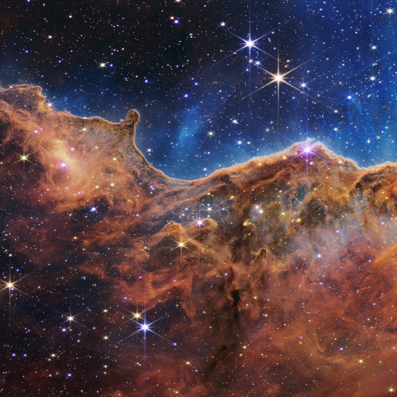

<a name="readme-top"></a>
[![Contributors][contributors-shield]][contributors-url]
[![Forks][forks-shield]][forks-url]
[![Stargazers][stars-shield]][stars-url]
[![Issues][issues-shield]][issues-url]
[![MIT License][license-shield]][license-url]

<!-- PROJECT LOGO -->
<br />
<div align="center">
  <a href="https://github.com/HttpRafa/Universe-Matter">
    
  </a>

<h3 align="center">Universe Matter</h3>

  <p align="center">
    Allows the use of energy from the universe. BUT BE CAREFUL!
    <br />
    <a href="https://github.com/HttpRafa/Universe-Matter"><strong>Explore the docs »</strong></a>
    <br />
    <br />
    <a href="https://github.com/HttpRafa/Universe-Matter/issues">Report Bug</a>
    ·
    <a href="https://github.com/HttpRafa/Universe-Matter/discussions">Request Feature</a>
  </p>
</div>

<!-- TABLE OF CONTENTS -->
<details>
  <summary>Table of Contents</summary>
  <ol>
    <li>
      <a href="#about-the-project">About The Project</a>
    </li>
    <li><a href="#roadmap">Roadmap</a></li>
    <li><a href="#contributing">Contributing</a></li>
    <li><a href="#license">License</a></li>
  </ol>
</details>

<!-- ABOUT THE PROJECT -->
## About The Project

Universe Matter is a mod that is intended to expand the minecraft endgame. The end goal of the mod is for the player to access the energy of the solar system and the universe. This energy can then be used, for example, to create items from matter.

<p align="right">(<a href="#readme-top">back to top</a>)</p>

### Installation
```Nothing at the moment```

<!--1. Download the jarfile
2. Clone the repo
   ```sh
   git clone https://github.com/HttpRafa/Universe-Matter.git
   ```
3. Install NPM packages
   ```sh
   npm install
   ```
4. Enter your API in `config.js`
   ```js
   const API_KEY = 'ENTER YOUR API';
   ```-->

<p align="right">(<a href="#readme-top">back to top</a>)</p>

<!-- ROADMAP -->
## [Roadmap](https://github.com/HttpRafa/Universe-Matter/discussions/3)

<!-- CONTRIBUTING -->
## Contributing

Contributions are what make the open source community such an amazing place to learn, inspire, and create. Any contributions you make are **greatly appreciated**.

If you have a suggestion that would make this better, please fork the repo and create a pull request. You can also simply open an issue with the tag "enhancement".
Don't forget to give the project a star! Thanks again!

1. Fork the Project
2. Create your Feature Branch (`git checkout -b feature/AmazingFeature`)
3. Commit your Changes (`git commit -m 'Add some AmazingFeature'`)
4. Push to the Branch (`git push origin feature/AmazingFeature`)
5. Open a Pull Request

<p align="right">(<a href="#readme-top">back to top</a>)</p>

<!-- LICENSE -->
## License

Distributed under the MIT License. See `LICENSE` for more information.

<p align="right">(<a href="#readme-top">back to top</a>)</p>

<!-- MARKDOWN LINKS & IMAGES -->
<!-- https://www.markdownguide.org/basic-syntax/#reference-style-links -->
[contributors-shield]: https://img.shields.io/github/contributors/HttpRafa/Universe-Matter.svg?style=for-the-badge
[contributors-url]: https://github.com/HttpRafa/Universe-Matter/graphs/contributors
[forks-shield]: https://img.shields.io/github/forks/HttpRafa/Universe-Matter.svg?style=for-the-badge
[forks-url]: https://github.com/HttpRafa/Universe-Matter/network/members
[stars-shield]: https://img.shields.io/github/stars/HttpRafa/Universe-Matter.svg?style=for-the-badge
[stars-url]: https://github.com/HttpRafa/Universe-Matter/stargazers
[issues-shield]: https://img.shields.io/github/issues/HttpRafa/Universe-Matter.svg?style=for-the-badge
[issues-url]: https://github.com/HttpRafa/Universe-Matter/issues
[license-shield]: https://img.shields.io/github/license/HttpRafa/Universe-Matter.svg?style=for-the-badge
[license-url]: https://github.com/HttpRafa/Universe-Matter/blob/master/LICENSE.txt